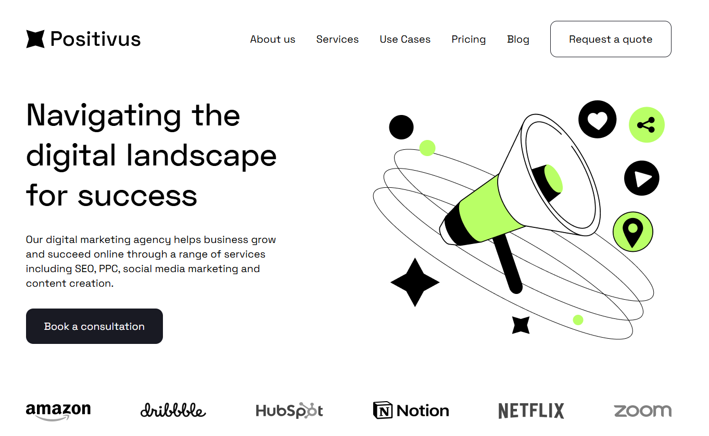

# Agency лэндинг

## Описание

Репозиторий представляет собой лендинг сайта цифрового маркетингового агентства. Включает все основные разделы. Основная поставленная цель - практика в изучении TypeScript и Tailwind.



## Ключевые особенности

- Адаптивный дизайн на базе Tailwind (Mobile first)
- Pixel-Perfect
- Оптимизированная сборка
- Анимации для разных UI-компонентов
- Slider без использования сторонних библиотек (не считая Skeleton-анимацию)
- Модульность и строгая типизация параметров

## Стек технологий

- React
- TypeScript
- Vite
- Tailwind CSS
- React-loading-skeleton (Анимация слайдов перед загрузкой)

## Установка и запуск

<!-- markdownlint-disable MD029 -->

1. Клонируем репозиторий:

```bash
git clone https://github.com/Niko142/Agency.git
# и переход в нужную папку
cd Agency
```

2. Устанавливаем зависимости

```bash
npm install
# или
yarn install
```

3. Запуск проекта в development-режиме

```bash
npm run dev
# или
yarn dev
```

4. Сборка для production

```bash
npm run build
# или
yarn build
```

5. Запуск production-сборки

```bash
npm run preview
# или
yarn preview
```

## Ссылки

[Демо-версия](https://agency-eosin-nine.vercel.app/)

[Макет в Figma](https://www.figma.com/community/file/1230604708032389430)
